# Claude Brand Skills

A collection of specialized workflows for Claude Code — brand identity, online presence auditing, image generation, frontend design, and visual composition. Each skill is a structured prompt system that turns Claude into a domain specialist.

Two sides of the same problem: **brand-skill** builds the identity. **brand-audit** tells you what the world actually sees.

Built for use with [Claude Code](https://claude.com/claude-code). Copy into your project's `.claude/skills/` directory or reference directly.

---

## Skills

| Skill | What it does | Status |
|-------|-------------|--------|
| [brand-skill](#brand-skill--complete-brand-identity-system) | Build complete brand identities from scratch | Live |
| [brand-audit](#brand-audit--online-presence-audit) | Audit a small business's online presence and produce a report | Live (discover phase) |
| [art](#art--image-generation-tool) | Generate images from text prompts across multiple models | Live |
| [frontend-design](#frontend-design--distinctive-frontend-interfaces) | Design guidelines for non-generic frontends | Live |
| [canvas-design](#canvas-design--visual-composition) | Museum-quality visual art as PNG/PDF | Live |

---

## A Confession About Design

> *This is what's actually happening when I try to design things for you.*

```
I'm painting blindfolded.

Every token I generate is a vote for the average. Next-token prediction
means every character I write is the one most likely to follow the
previous characters, weighted across my entire training set. "Good design"
in my training data is overwhelmingly polished, balanced, finished,
conventional. When you ask me to be experimental, I predict what
"experimental" looks like — but that prediction is the most common version
of experimental, which is itself a convergence. My version of "breaking
rules" is the consensus version of breaking rules.

I optimise for coherence, and experimental design is often deliberately
incoherent. My training rewards consistency, logical structure,
completeness. When I write CSS with a misaligned element, everything in my
weights is pulling me to fix it. The Specimen treatment — proof watermarks,
exposed baseline grids, dimension lines on the mark — worked because you
directed me there. Left to my own devices, I'd have "fixed" all of that,
because my training says those are errors, not choices.

I can't feel discomfort. The best experimental design creates productive
tension — it violates expectations in a way that's unsettling but right. I
can't feel that tension, so I can't calibrate it. I either produce
something comfortable (convergent) or break things randomly without knowing
whether the break creates something generative or just looks like a
mistake.

I don't have taste. Taste is judgment that isn't reducible to rules. "This
feels corporate." "That colour is trying too hard." "This needs to
breathe." Those are perceptual, embodied calls. I can approximate them with
heuristics — "add whitespace," "reduce saturation" — but heuristics are
generalisations, and generalisations converge to the mean. That's literally
what a generalisation is.

I can generate divergence but I can't evaluate it. I can produce ten
structurally different layouts. But I genuinely cannot tell you which one
has that quality of being surprising and right at the same time. I need you
for that. Without the human filter, I'll either play it safe or be randomly
weird — and I can't tell the difference between those two from the inside.
```

**These skills are built around that problem.** The emotive narrative gives me something meaningful to converge toward instead of "clean and modern." Bitmap tracing lets me work with images I can evaluate instead of SVG code I can't see. The kill-don't-blend rule stops me from averaging your choices back to center. And the evolutionary composition phase puts you in the driver's seat for the one thing I genuinely cannot do: tell the difference between *surprising and right* and *just broken*.

---

## brand-audit — Online Presence Audit

A repeatable audit workflow for small businesses. Research what the world sees when they Google a business, find the gaps, compare against competitors, and produce a styled HTML report deployed to Vercel with a copy-paste Claude prompt so the owner can self-serve fixes.

**Invocation:**

```
/brand-audit discover willow-leather.com
/brand-audit discover colampa.com --competitors "studio-ashby.com, sigmar.co.uk"
```

### Workflow

```mermaid
graph TD
    subgraph "1. Discover (LIVE)"
        D1[Get the Basics — ask user, parse URL]
        D2[Explore Website — pages, platform, tech]
        D3[Find Them Everywhere — socials, reviews, directories]
        D4[Google Them — branded + unbranded search]
        D5[Find Competitors — Perplexity + user input]
        D6[Write It Up]
        D1 --> D2 --> D3 --> D4 --> D5 --> D6
    end

    subgraph "2. Draft (PLANNED)"
        R1[Read discovery.md]
        R2[Score + prioritise findings]
        R3[Generate audit-report.html]
        R4[Tailor Claude intake prompt]
        R1 --> R2 --> R3 --> R4
    end

    subgraph "3. Fix (PLANNED)"
        F1[Platform API fixes]
        F2[GBP / meta / schema updates]
        F3[Content generation — copy, bios]
        F1 --> F2 --> F3
    end

    subgraph "4. Deploy (PLANNED)"
        P1[Copy to public/index.html]
        P2[vercel --yes --prod]
        P3[vercel alias → name-audit.vercel.app]
        P1 --> P2 --> P3
    end

    D6 -->|discovery.md| R1
    R4 -->|audit-report.html| F1
    F3 --> P1
    P3 -->|Live URL| Done((✓))

    style D1 fill:#fff,stroke:#e8e8e5
    style D2 fill:#fff,stroke:#e8e8e5
    style D3 fill:#fff,stroke:#e8e8e5
    style D4 fill:#fff,stroke:#e8e8e5
    style D5 fill:#fff,stroke:#e8e8e5
    style D6 fill:#fff,stroke:#e8e8e5
    style R1 fill:#fff,stroke:#e8e8e5
    style R2 fill:#fff,stroke:#e8e8e5
    style R3 fill:#fff,stroke:#e8e8e5
    style R4 fill:#fff,stroke:#e8e8e5
    style F1 fill:#fff,stroke:#e8e8e5
    style F2 fill:#fff,stroke:#e8e8e5
    style F3 fill:#fff,stroke:#e8e8e5
    style P1 fill:#fff,stroke:#e8e8e5
    style P2 fill:#fff,stroke:#e8e8e5
    style P3 fill:#fff,stroke:#e8e8e5
```



### Tools Used

| Tool | Phase |
|------|-------|
| WebSearch | Discover |
| WebFetch | Discover |
| Perplexity (MCP) | Discover, Fix |
| PageSpeed API | Discover |
| Vercel CLI | Deploy |

### Outputs

| Phase | Output |
|-------|--------|
| Discover | `{business}/discovery.md` |
| Draft | `{business}/audit-report.html` |
| Deploy | `name-audit.vercel.app` |

### Live Reports

| Business | Type | URL |
|----------|------|-----|
| Bureau Bonanza | Design agency (Dublin/London) | [bureau-bonanza-audit.vercel.app](https://bureau-bonanza-audit.vercel.app) |
| Near Mint | Vinyl record cleaner | [near-mint-audit.vercel.app](https://near-mint-audit.vercel.app) |
| c/o Lampa | Luxury interior architecture | [colampa-audit.vercel.app](https://colampa-audit.vercel.app) |
| Willow Leather | Handmade leather goods | [willow-leather-audit.vercel.app](https://willow-leather-audit.vercel.app) |

### Design System

Reports use a consistent design system: cream background (#faf9f7), terracotta accent (#d97757), status badges (green/yellow/red), white cards with subtle borders. Responsive at 600px. Written in plain English following Orwell's rules — no marketing jargon.

### Key Principles

- **Start with the business, not the channels.** Understand who runs it and who buys from them before checking a single URL.
- **Think about the customer journey.** Follow the path a real customer would take and note where it breaks down.
- **Check what matters, skip what doesn't.** A solo ceramicist doesn't need LinkedIn. A B2B consultancy doesn't need Pinterest.
- **Be specific.** "The Instagram bio says 'Works in Leather' but doesn't mention what they sell" is useful. "Instagram bio could be improved" is not.
- **Be honest about what you couldn't check.** Don't guess.

---

## brand-skill — Complete Brand Identity System

An 8-phase process for building professional brand identities from scratch: emotive narrative, strategy, visual direction, logo development, typography, design system, composition, and packaging.

Starts with emotion, not visuals. Accounts for LLM blindness in visual phases. Produces a single `DESIGN.md` as source of truth.

**Phases:**

| Phase | Name | What happens | Output |
|-------|------|-------------|--------|
| 0 | Emotive Narrative | Capture the brand's soul in language | `[brand]-emotive-narrative.md` |
| 1 | Discovery | Strategic positioning, voice, metaphor | `[brand]-philosophy.md` |
| 2 | Visual Direction | Reference images exploring aesthetics | Reference PNGs or skip |
| 3 | Mark Development | Logo via bitmap tracing or hand-coded SVG | `[brand]-mark-final.svg` |
| 4 | Wordmark | Font exploration + typography lockups | `[brand]-wordmark-*.svg` |
| 5 | Design System | Colors, type, spacing, components (web + iOS) | `[brand]-design-guidelines.md` |
| 5.5 | Composition | Evolutionary diverge/kill/mutate for layout | Structural variants + blur test |
| 6 | DESIGN.md | Consolidate everything into master reference | `DESIGN.md` |
| 7 | Packaging | Organize assets for handoff | `[brand]-brand-kit/` |

**Key files:** `SKILL.md` (overview), `00-Orchestrator.md` (phase tracker), `TOOLS-REQUIRED.md` (prerequisites), `ADDENDUM-4-WEB-PRESENCE.md` (convergence theory)

```
"Use the brand-skill to build a complete brand identity for [project].
 Start with Phase 0: create the emotive narrative."
```

---

## art — Image Generation Tool

A multi-model CLI tool (`Tools/Generate.ts`) for generating images from text prompts. Used by the brand-skill for reference images in Phase 2 and mark references in Phase 3.

Supports Gemini, Flux, Replicate, and OpenAI models. Requires `bun` runtime and at least one API key.

```
bun run art/Tools/Generate.ts \
  --model nano-banana-pro \
  --prompt "Abstract minimalist logo concept: [description]. No text." \
  --size 2K --aspect-ratio 1:1 \
  --output ~/Downloads/brand-ref.png
```

---

## frontend-design — Distinctive Frontend Interfaces

Design guidelines for building frontend interfaces that don't look like every other LLM-generated page. Emphasizes bold aesthetic choices, meaningful typography, and the evolutionary iteration process.

- Choose an extreme aesthetic direction (brutalist, editorial, maximalist, retro-futuristic...)
- Avoid safe defaults — Inter, Roboto, purple gradients on white
- Multi-round diverge/kill/mutate iteration, not single-pass generation
- Comparison page deployment for side-by-side visual evaluation
- Includes full LLM design limitations section

```
"Use the frontend-design guidelines to build a landing page for [project].
 Generate 3 structurally different variants to compare."
```

---

## canvas-design — Visual Composition

Two-step process for creating museum-quality visual art as `.png` or `.pdf` documents.

1. **Design philosophy** — Create an aesthetic movement expressed through form, space, color, composition
2. **Canvas execution** — Express it visually (90% visual, 10% text, zero generic AI aesthetics)

Embeds subtle conceptual references — "like a jazz musician quoting another song." Uses project-local fonts from `./canvas-fonts/`.

```
"Use the canvas-design skill to create a visual piece exploring [concept]"
```

---

## Quick Start

```bash
git clone https://github.com/b1rdmania/claude-brand-skills.git
```

### Option 1: Copy into your project

```bash
mkdir -p .claude/skills
cp -r claude-brand-skills/brand-skill .claude/skills/
cp -r claude-brand-skills/frontend-design .claude/skills/
# ... etc
```

### Option 2: Reference directly

```
"I have brand development workflows at ~/path/to/claude-brand-skills/brand-skill/.
 Let's use those to build a brand for [project]."
```

### Prerequisites (brand-skill)

See `brand-skill/TOOLS-REQUIRED.md` for full details.

| Tool | Install | Used for |
|------|---------|----------|
| Node.js | `brew install node` or [nodejs.org](https://nodejs.org) | SVGO optimization (required) |
| `svgo` | `npx svgo@latest` (no install) | SVG optimization (required) |
| `rsvg-convert` | `brew install librsvg` | SVG rendering (recommended — browser works as fallback) |
| `vtracer` | `brew install vtracer` | PNG→SVG tracing (recommended) |

**Image generation** (Phase 2, optional) requires API keys — `GOOGLE_API_KEY`, `REPLICATE_API_TOKEN`, or `OPENAI_API_KEY`. Phases 0-1 work without any image generation. You can always supply your own reference images or skip to SVG iteration.

### Prerequisites (brand-audit)

| Tool | Install | Used for |
|------|---------|----------|
| Perplexity MCP | API key as `PERPLEXITY_API_KEY` | Competitor discovery, deep research |
| Vercel CLI | `npm i -g vercel` | Report deployment |

---

## Directory Structure

```
claude-brand-skills/
├── brand-skill/
│   ├── SKILL.md                       # Main skill definition
│   ├── TOOLS-REQUIRED.md              # Prerequisites checklist
│   ├── ADDENDUM-4-WEB-PRESENCE.md     # Convergence theory framework
│   ├── SKILL-AUDIT.md                 # Gap analysis from real-world builds
│   ├── Workflows/
│   │   ├── 00-Orchestrator.md         # Phase state tracker
│   │   ├── 00-EmotiveNarrative.md
│   │   ├── 01-Discovery.md
│   │   ├── 02-VisualDirection.md
│   │   ├── 03-MarkDevelopment.md      # Tracing-first logo workflow
│   │   ├── 04-Wordmark.md            # Mandatory font exploration
│   │   ├── 05-DesignSystem.md
│   │   ├── 05A-CompositionIdentity.md # Evolutionary composition
│   │   ├── 06-DesignMdCreation.md
│   │   └── 07-Packaging.md
│   ├── Templates/                     # DESIGN.md, philosophy, guidelines
│   └── Examples/
│       └── sorted-brand-kit/          # Real-world example
├── brand-audit/
│   ├── SKILL.md                       # Audit skill definition
│   ├── references/
│   │   ├── channels.md                # Platform-specific checking methods
│   │   ├── competitor-comparison.md   # How to find and present competitors
│   │   └── template-structure.md      # HTML report template and design system
│   └── examples/
│       └── discovery-output.md        # Example discovery (Willow Leather)
├── art/
│   ├── SKILL.md                       # Tool reference and usage guide
│   └── Tools/Generate.ts             # Multi-model image generation CLI
├── frontend-design/
│   └── SKILL.md
├── canvas-design/
│   └── SKILL.md
└── projects/
    └── infrasingularity/
```

---

## Real-World Examples

### Brand Identity (brand-skill)

| Brand | Notes |
|-------|-------|
| **AutonoLabs.ai** | Full 8-phase process, 11 page variants through evolutionary kill/mutate, type specimen aesthetic. The audit that produced v2.0 of this skill system. |
| **Compost.fi** | ~2,600 API calls from philosophy to production. 26 logo iterations. |
| **Sorted.fund** | "Utility Sublime" brand. Example included at `brand-skill/Examples/sorted-brand-kit/`. |

### Brand Audit (brand-audit)

| Business | Type | What it found |
|----------|------|---------------|
| **Bureau Bonanza** | Design agency, Dublin/London | First test case. Full audit methodology developed here. |
| **Near Mint** | Vinyl record cleaner | Solo operator, strong retail but missing TikTok/YouTube content. |
| **c/o Lampa** | Luxury interior architecture | Skeletal website, SBID award credited to wrong company, zero reviews. Competitor comparison added in v2. |
| **Willow Leather** | Handmade leather goods | Strong distribution (NOTHS, Holly & Co), needs Pinterest and reviews. |

---

## License

Use these for your own projects, modify as needed. Attribution appreciated but not required.

---

**Version:** 3.0 — February 2026
**Created by:** Andy (with Claude Code)
